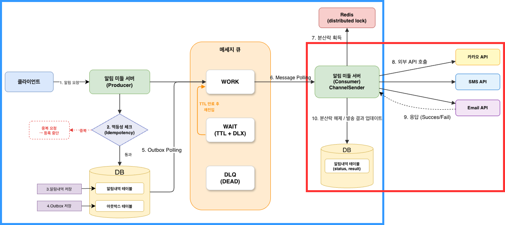
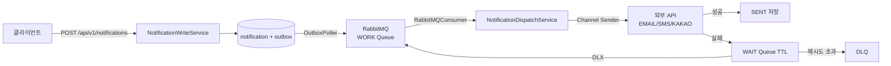

# Notification Dispatcher

## 프로젝트 개요

여러 서비스에서 중복 구현되던 알림 발송 로직을 단일 서비스로 통합한 **알림 발송 전용 서버**입니다.

`order-service`, `payment-service` 등 클라이언트 서비스는 HTTP API 한 번만 호출하면 되고, 채널 발송(EMAIL/SMS/KAKAO), 재시도, 중복 방지, 상태 추적은 이 서비스가 담당합니다.

```
클라이언트 서비스 → POST /api/v1/notifications
                         ↓
               Notification Dispatcher
               ├── 알림 저장 + Outbox 기록
               ├── RabbitMQ 비동기 발송
               ├── 실패 시 지수 백오프 재시도
               ├── 읽음 상태 관리
               └── 7일 경과 데이터 아카이빙
```

## 프로젝트 목표

이 프로젝트는 기능 구현보다 **실무 수준의 설계 원칙을 직접 적용하고 검증**하는 데 초점을 둡니다.

| 목표 | 적용 방식 |
|------|-----------|
| 메시지 유실 없는 비동기 발송 | Transactional Outbox 패턴 |
| 다중 인스턴스 환경 중복 처리 방지 | Redis 분산 락 (Redisson) |
| 외부 API 장애 대응 재시도 | WAIT Queue TTL + DLX 라우팅 |
| 도메인/인프라 분리 | Hexagonal Architecture (Port/Adapter) |
| 대규모 데이터 효율적 보관/삭제 | 월별 RANGE 파티션 + 배치 아카이빙 |
| 핫쿼리 성능 검증 | EXPLAIN ANALYZE 기반 인덱스 벤치마크 |

## 기술 스택

- 
- 
- 
- 
- 
- 
- 
- 
- 
- 

## 문서
[Wiki](https://github.com/yht0827/notification-dispatcher/wiki)

## 아키텍처

### 시스템 아키텍처



### 비동기 발송 파이프라인



### Hexagonal Architecture

`api` → `application (port)` → `domain` ← `infrastructure (adapter)`


## API

| 기능 | METHOD | URI |
|------|--------|-----|
| 알림 발송 | POST | `/api/v1/notifications` |
| 개별 알림 조회 | GET | `/api/v1/notifications/{notificationId}` |
| 알림 읽음 처리 | PATCH | `/api/v1/notifications/{notificationId}/read` |
| 그룹 상세 조회 | GET | `/api/v1/notifications/groups/{groupId}` |
| 그룹 목록 조회 (커서 페이징) | GET | `/api/v1/notifications/groups?clientId={clientId}` |
| 그룹 전체 읽음 처리 | PATCH | `/api/v1/notifications/groups/{groupId}/read` |

Swagger UI: `http://localhost:8080/swagger-ui/index.html`


## 핵심 설계

| 패턴 | 설명 |
|------|------|
| Transactional Outbox | 알림 저장 + Outbox를 동일 트랜잭션으로 처리해 메시지 유실 방지 |
| Distributed Lock | Redis(Redisson)로 notificationId 단위 중복 발송 방지 |
| WAIT Queue + DLX | 실패 시 지수 백오프 재시도, 한도 초과 시 DLQ 보관 |
| Batch Consumer Switch | `batch-listener-enabled` 설정으로 단건/배치 컨슈머 전환 |
| Separate Read Status | `notification_read_status` 별도 테이블로 읽음 상태 관리 |
| Monthly Archive | 7일 경과 + 종결 알림을 월별 RANGE 파티션 archive 테이블로 이관 |
| Idempotency Key | `(clientId, idempotencyKey)` 기반 중복 요청 방지 |

## 디렉토리 구조

```
notification-dispatcher/
├── app/                  # Spring Boot 실행 모듈
├── api/                  # Controller, DTO, 예외 처리, Swagger
├── application/          # UseCase, Service, Port
├── domain/               # Entity, Enum, 도메인 규칙
├── infrastructure/       # JPA/JDBC/RabbitMQ/Outbox/Lock/Sender/Archive 구현
├── docs/                 # 요구사항/시퀀스/클래스/ERD/Wiki 문서
├── docker/               # 로컬 MySQL + Redis + 모니터링 docker-compose
├── http/                 # API 호출 예시 (.http)
├── Makefile              # 개발 환경 명령어
└── settings.gradle       # 멀티 모듈 설정
```

## 로컬 실행

```bash
# 인프라 시작 (MySQL + Redis + RabbitMQ)
make up

# 애플리케이션 실행
make run

# 테스트 실행
make test

# 모니터링 포함 전체 기동
make up-all
```

---

## API

| 기능 | METHOD | URI |
|------|--------|-----|
| 알림 발송 | POST | `/api/v1/notifications` |
| 개별 알림 조회 | GET | `/api/v1/notifications/{notificationId}` |
| 알림 읽음 처리 | PATCH | `/api/v1/notifications/{notificationId}/read` |
| 그룹 상세 조회 | GET | `/api/v1/notifications/groups/{groupId}` |
| 그룹 목록 조회 (커서 페이징) | GET | `/api/v1/notifications/groups?clientId={clientId}` |
| 그룹 전체 읽음 처리 | PATCH | `/api/v1/notifications/groups/{groupId}/read` |

Swagger UI: `http://localhost:8080/swagger-ui/index.html`

---

## 핵심 설계

| 패턴 | 설명 |
|------|------|
| Transactional Outbox | 알림 저장 + Outbox를 동일 트랜잭션으로 처리해 메시지 유실 방지 |
| Distributed Lock | Redis(Redisson)로 notificationId 단위 중복 발송 방지 |
| WAIT Queue + DLX | 실패 시 지수 백오프 재시도, 한도 초과 시 DLQ 보관 |
| Batch Consumer Switch | `batch-listener-enabled` 설정으로 단건/배치 컨슈머 전환 |
| Separate Read Status | `notification_read_status` 별도 테이블로 읽음 상태 관리 |
| Monthly Archive | 7일 경과 + 종결 알림을 월별 RANGE 파티션 archive 테이블로 이관 |
| Idempotency Key | `(clientId, idempotencyKey)` 기반 중복 요청 방지 |

---

## 디렉토리 구조

```
notification-dispatcher/
├── app/                  # Spring Boot 실행 모듈
├── api/                  # Controller, DTO, 예외 처리, Swagger
├── application/          # UseCase, Service, Port
├── domain/               # Entity, Enum, 도메인 규칙
├── infrastructure/       # JPA/JDBC/RabbitMQ/Outbox/Lock/Sender/Archive 구현
├── docs/                 # 요구사항/시퀀스/클래스/ERD 문서
├── docker/               # 로컬 MySQL + Redis + 모니터링 docker-compose
├── http/                 # API 호출 예시 (.http)
├── Makefile              # 개발 환경 명령어
└── settings.gradle       # 멀티 모듈 설정
```

---

## 로컬 실행

```bash
# 인프라 시작 (MySQL + Redis + RabbitMQ)
make up

# 애플리케이션 실행
make run

# 테스트 실행
make test

# 모니터링 포함 전체 기동
make up-all
```

필수 환경변수: `DB_URL`, `DB_USERNAME`, `DB_PASSWORD`, `REDIS_HOST`, `REDIS_PORT`
