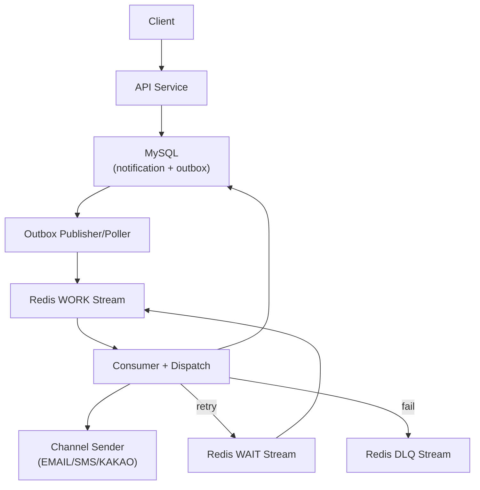

# Notification Dispatcher

알림 발송 요청을 비동기 파이프라인(Outbox + Redis Stream)으로 처리하는 멀티 모듈 프로젝트입니다.

## 문서 인덱스
- [01. 요구사항 정의서](docs/01-requirements.md)
- [02. 시퀀스 다이어그램](docs/02-sequence-diagrams.md)
- [03. 클래스 다이어그램](docs/03-class-diagrams.md)
- [04. ERD](docs/04-erd.md)

## 기술 스택

| 구분 | 스택 |
|---|---|
| Language / Build | Java 21, Gradle (Multi-module) |
| Framework | Spring Boot 3.5.12-SNAPSHOT, Spring Web, Spring Validation |
| Persistence | Spring Data JPA, MySQL, Flyway |
| Messaging / Concurrency | Redis Streams, Redisson (Distributed Lock), Spring Scheduling |
| API Docs | springdoc-openapi-starter-webmvc-ui 2.7.0 |
| Test | JUnit 5, Mockito, Spring Boot Test, Testcontainers (MySQL/Redis) |

## Swagger

- Swagger UI: `http://localhost:8080/swagger-ui/index.html`
- OpenAPI JSON: `http://localhost:8080/v3/api-docs`
- OpenAPI 기본 정보 설정: `api/src/main/java/com/example/api/config/SwaggerConfig.java`

로컬 실행 후 확인

```bash
make up
make run
```

## 디렉토리 구조

```text
notification-dispatcher/
├── app/                  # Spring Boot 실행 모듈
├── api/                  # Controller, DTO, 예외 처리, Swagger
├── application/          # UseCase, Service, Port
├── domain/               # Entity, Enum, 도메인 규칙
├── infrastructure/       # JPA/Redis/Outbox/Lock/Sender 구현
├── docs/                 # 요구사항/시퀀스/클래스/ERD 문서
├── docker/               # 로컬 MySQL/Redis docker-compose
├── http/                 # API 호출 예시 (.http)
├── Makefile              # up/down/run/test/build 명령
└── settings.gradle       # 멀티 모듈 설정
```

## 아키텍처 구조

### 1) Layered + Hexagonal

```text
Client
  -> API Adapter (NotificationController)
  -> Application UseCase (Command/Query/Dispatch Service)
  -> Domain Model (Notification, NotificationGroup, Outbox)
  -> Infrastructure Adapter (Repository, Redis Stream, Sender, Lock)
```

### 2) 비동기 발송 파이프라인

```text
POST /api/v1/notifications
  -> notification_group + notification + outbox 저장 (트랜잭션)
  -> OutboxPoller가 PENDING outbox를 WORK 스트림으로 발행
  -> RedisStreamConsumer가 WORK 메시지 소비
  -> DispatchLockManager로 중복 처리 방지
  -> ChannelSender(EMAIL/SMS/KAKAO)로 발송

실패 처리:
  - 재시도 가능: WAIT 스트림 이동 -> WaitScheduler가 재발행
  - 재시도 불가/한도 초과: DLQ 스트림 이동
```

### 3) 전체 흐름도 (Service + Outbox + Redis Streams)


