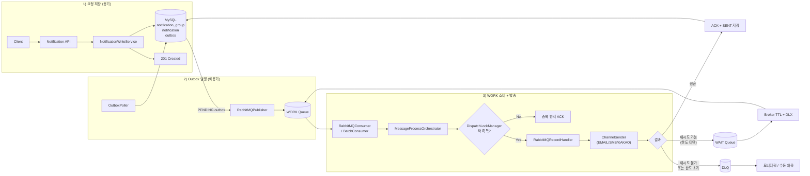

# Notification Dispatcher

알림 발송 요청을 비동기 파이프라인(Outbox + RabbitMQ)으로 처리하는 멀티 모듈 Spring Boot 프로젝트입니다.

---

## 기술 스택

- 
- 
- 
- 
- 
- 
- 
- 
- 
- 

---

## 문서

| # | 문서 | 설명 |
|---|------|------|
| 01 | [요구사항 정의서](docs/01-requirements.md) | API 명세, 상태 전이, 비동기 처리 규칙 |
| 02 | [시퀀스 다이어그램](docs/02-sequence-diagrams.md) | 주요 런타임 흐름 (발송/읽음/아카이브) |
| 03 | [클래스 다이어그램](docs/03-class-diagrams.md) | 계층 구조 및 핵심 클래스 관계 |
| 04 | [ERD](docs/04-erd.md) | 테이블 설계 및 파티션 구조 |

---

## 아키텍처

### Hexagonal Architecture

```
┌─────────────────────────────────────────────┐
│  Frameworks / Drivers                        │
│  (Spring Boot, MySQL, RabbitMQ, Redis)       │
│  ┌───────────────────────────────────────┐   │
│  │  Adapters                             │   │
│  │   - api           (inbound)           │   │
│  │   - infrastructure (outbound)         │   │
│  │  ┌─────────────────────────────────┐  │   │
│  │  │  Application                    │  │   │
│  │  │   - UseCase, Port, Service      │  │   │
│  │  │  ┌───────────────────────────┐  │  │   │
│  │  │  │  Domain                   │  │  │   │
│  │  │  │   - Entity, Rule, Enum    │  │  │   │
│  │  │  └───────────────────────────┘  │  │   │
│  │  └─────────────────────────────────┘  │   │
│  └───────────────────────────────────────┘   │
└─────────────────────────────────────────────┘
```

### 비동기 발송 파이프라인



---

## API

| 기능 | METHOD | URI |
|------|--------|-----|
| 알림 발송 | POST | `/api/v1/notifications` |
| 개별 알림 조회 | GET | `/api/v1/notifications/{notificationId}` |
| 알림 읽음 처리 | PATCH | `/api/v1/notifications/{notificationId}/read` |
| 그룹 상세 조회 | GET | `/api/v1/notifications/groups/{groupId}` |
| 그룹 목록 조회 (커서 페이징) | GET | `/api/v1/notifications/groups?clientId={clientId}` |
| 그룹 전체 읽음 처리 | PATCH | `/api/v1/notifications/groups/{groupId}/read` |

Swagger UI: `http://localhost:8080/swagger-ui/index.html`

---

## 핵심 설계

| 패턴 | 설명 |
|------|------|
| Transactional Outbox | 알림 저장 + Outbox를 동일 트랜잭션으로 처리해 메시지 유실 방지 |
| Distributed Lock | Redis(Redisson)로 notificationId 단위 중복 발송 방지 |
| WAIT Queue + DLX | 실패 시 지수 백오프 재시도, 한도 초과 시 DLQ 보관 |
| Batch Consumer Switch | `batch-listener-enabled` 설정으로 단건/배치 컨슈머 전환 |
| Separate Read Status | `notification_read_status` 별도 테이블로 읽음 상태 관리 |
| Monthly Archive | 7일 경과 + 종결 알림을 월별 RANGE 파티션 archive 테이블로 이관 |
| Idempotency Key | `(clientId, idempotencyKey)` 기반 중복 요청 방지 |

---

## 디렉토리 구조

```
notification-dispatcher/
├── app/                  # Spring Boot 실행 모듈
├── api/                  # Controller, DTO, 예외 처리, Swagger
├── application/          # UseCase, Service, Port
├── domain/               # Entity, Enum, 도메인 규칙
├── infrastructure/       # JPA/JDBC/RabbitMQ/Outbox/Lock/Sender/Archive 구현
├── docs/                 # 요구사항/시퀀스/클래스/ERD 문서
├── docker/               # 로컬 MySQL + Redis + 모니터링 docker-compose
├── http/                 # API 호출 예시 (.http)
├── Makefile              # 개발 환경 명령어
└── settings.gradle       # 멀티 모듈 설정
```

---

## 로컬 실행

```bash
# 인프라 시작 (MySQL + Redis + RabbitMQ)
make up

# 애플리케이션 실행
make run

# 테스트 실행
make test

# 모니터링 포함 전체 기동
make up-all
```

필수 환경변수: `DB_URL`, `DB_USERNAME`, `DB_PASSWORD`, `REDIS_HOST`, `REDIS_PORT`
