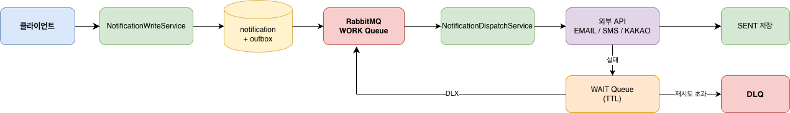

# Notification Dispatcher

## 프로젝트 개요

여러 클라이언트의 알림 발송 요청을 받아 Mock 발송 서버로 중개하는 미들 서버입니다.

클라이언트는 HTTP 요청 한 번으로 발송을 위임하고, 비동기 처리·재시도·중복 방지·상태 추적은 이 서버가 전담합니다.

```
클라이언트 서비스 → POST /api/v1/notifications
                         ↓
               Notification Dispatcher
               ├── 알림 저장 + Outbox 기록
               ├── RabbitMQ 비동기 발송
               ├── 실패 시 지수 백오프 재시도
               ├── 읽음 상태 관리
               └── 7일 경과 데이터 아카이빙
```

## 기술 스택

| 카테고리 | 기술 | 버전 |
|----------|------|------|
| Language | Java | 21 |
| Framework | Spring Boot | 3.5.12 |
| Database | MySQL | 8.0.32 |
| Cache / Lock | Redis | 7.2.4 |
| Message Broker | RabbitMQ | 3.13.0 |
| Build | Gradle | 8.5 |
| Test | JUnit 5 / JaCoCo | - |
| Container | Docker | 24.0.2 |
| Load Test | K6 | - |

## 아키텍처

### 시스템 아키텍처


### 비동기 발송 파이프라인



### Hexagonal Architecture

`api` → `application (port)` → `domain` ← `infrastructure / worker (adapter)`

### 실행 구조

기본 실행은 단일 프로세스지만, 운영에서는 역할을 나눠 실행할 수 있습니다.

- `API 프로세스`
  - HTTP 요청 수신
  - 알림 생성/조회/읽음 처리
- `Consumer 프로세스`
  - Outbox Poller
  - RabbitMQ Consumer
  - 백그라운드 발송 처리

같은 `app` 모듈을 설정만 다르게 실행하는 방식입니다.

## 핵심 설계

| 패턴 | 설명 |
|------|------|
| Transactional Outbox | 알림 저장 + Outbox를 동일 트랜잭션으로 처리해 메시지 유실 방지 |
| Distributed Lock | Redis(Redisson)로 notificationId 단위 중복 발송 방지 |
| WAIT Queue + DLX | 실패 시 지수 백오프 재시도, 한도 초과 시 DLQ 보관 |
| Separate Read Status | `notification_read_status` 별도 테이블로 읽음 상태 관리 |
| Monthly Archive | 보관 정책 경과 + 종결 알림을 월별 RANGE 파티션 archive 테이블로 이관 |
| Idempotency Key | `(clientId, idempotencyKey)` 기반 중복 요청 방지 |
| Redis Stats Cache | 관리자 통계 Redis 캐시 (`cache.stats.enabled`, TTL 설정) |

## API

| 기능 | METHOD | URI |
|------|--------|-----|
| 알림 발송 | POST | `/api/v1/notifications` |
| 개별 알림 조회 | GET | `/api/v1/notifications/{notificationId}` |
| 알림 읽음 처리 | PATCH | `/api/v1/notifications/{notificationId}/read` |
| 읽지 않은 알림 수 조회 | GET | `/api/v1/notifications/unread-count` |
| 수신자별 메시지 내역 조회 | GET | `/api/v1/notifications/receiver` |
| 그룹 상세 조회 | GET | `/api/v1/notifications/groups/{groupId}` |
| 그룹 목록 조회 (커서 페이징) | GET | `/api/v1/notifications/groups` |
| 그룹 전체 읽음 처리 | PATCH | `/api/v1/notifications/groups/{groupId}/read` |
| 전체 알림 통계 조회 | GET | `/api/admin/v1/stats` |
| 클라이언트별 알림 통계 조회 | GET | `/api/admin/v1/stats/{clientId}` |

Swagger UI: `http://localhost:8080/swagger-ui/index.html`

## 디렉토리 구조

```
notification-dispatcher/
├── app/                  # Spring Boot 실행 모듈
├── api/                  # Controller, DTO, 예외 처리, Swagger
├── application/          # UseCase, Service, Port
├── domain/               # Entity, Enum, 도메인 규칙
├── infrastructure/       # JPA/JDBC/Redis/Lock/Cache/Archive 구현
├── worker/               # RabbitMQ Consumer/Publisher, Polling, Sender 구현
├── docs/                 # 요구사항/시퀀스/클래스/ERD/Wiki 문서
├── docker/               # 로컬 MySQL + Redis + 모니터링 docker-compose
├── http/                 # API 호출 예시 (.http)
├── Makefile              # 개발 환경 명령어
└── settings.gradle       # 멀티 모듈 설정
```

## 실행 방법

### 로컬 실행

```bash
# 인프라 시작 (MySQL + Redis + RabbitMQ)
make up

# 애플리케이션 실행
make run

# 테스트 실행
make test

# 모니터링 포함 전체 기동
make up-all
```

필수 환경변수: `DB_URL`, `DB_USERNAME`, `DB_PASSWORD`, `REDIS_HOST`, `REDIS_PORT`

### 역할 분리 실행

```bash
# API 전용
java -jar app/build/libs/app-0.0.1-SNAPSHOT.jar \
  --spring.profiles.active=local \
  --app.consumer.enabled=false

# Consumer 전용
java -jar app/build/libs/app-0.0.1-SNAPSHOT.jar \
  --spring.profiles.active=local \
  --app.web.enabled=false \
  --spring.main.web-application-type=none
```

## CI/CD

### CI (Continuous Integration)

GitHub Actions 기반으로 빌드와 테스트를 자동 검증합니다.

- 대상: `main`, `develop`, `feature/*` 브랜치 push / PR
- 실행 내용: `./gradlew check jacocoAggregateReport` (모듈별 테스트 + 커버리지 검증)

### CD (Continuous Deployment)

현재 수동 배포 기준입니다.

```text
GitHub Actions로 CI 검증
        ↓
수동으로 EC2 배포
        ↓
Grafana / Prometheus로 확인
```

## 운영 환경

- App: AWS EC2
- DB: MySQL / RDS Primary + Read Replica
- Cache / Lock: Redis
- Broker: RabbitMQ
- Monitoring: Prometheus + Grafana

## 문서

### 설계

| 문서 | 설명 |
|------|------|
| [요구사항 정의](https://github.com/yht0827/notification-dispatcher/wiki/%5B%EC%84%A4%EA%B3%84%5D-%EC%9A%94%EA%B5%AC%EC%82%AC%ED%95%AD-%EC%A0%95%EC%9D%98) | API 명세, 상태 전이, 비동기 처리 규칙 |
| [아키텍처 결정](https://github.com/yht0827/notification-dispatcher/wiki/%5B%EC%84%A4%EA%B3%84%5D-%EC%95%84%ED%82%A4%ED%85%8D%EC%B2%98-%EA%B2%B0%EC%A0%95) | 아키텍처 선택 이유 |
| [시퀀스 다이어그램](https://github.com/yht0827/notification-dispatcher/wiki/%5B%EC%84%A4%EA%B3%84%5D-%EC%8B%9C%ED%80%80%EC%8A%A4-%EB%8B%A4%EC%9D%B4%EC%96%B4%EA%B7%B8%EB%9E%A8) | 주요 런타임 흐름 (발송/읽음/아카이브) |
| [클래스 다이어그램](https://github.com/yht0827/notification-dispatcher/wiki/%5B%EC%84%A4%EA%B3%84%5D-%ED%81%B4%EB%9E%98%EC%8A%A4-%EB%8B%A4%EC%9D%B4%EC%96%B4%EA%B7%B8%EB%9E%A8) | 계층 구조 및 핵심 클래스 관계 |
| [ERD](https://github.com/yht0827/notification-dispatcher/wiki/%5B%EC%84%A4%EA%B3%84%5D-ERD-(Entity-Relationship-Diagram)) | 테이블 설계 및 파티션 구조 |
| [동시성 제어](https://github.com/yht0827/notification-dispatcher/wiki/%5B%EC%84%A4%EA%B3%84%5D-%EB%8F%99%EC%8B%9C%EC%84%B1-%EC%A0%9C%EC%96%B4) | 낙관적 락 / 분산 락 / 비관적 락 비교 |
| [멱등성 및 Race Condition 검증](https://github.com/yht0827/notification-dispatcher/wiki/%5B%EC%84%A4%EA%B3%84%5D-%EB%A9%B1%EB%93%B1%EC%84%B1-%EB%B0%8F-Race-Condition-%EA%B2%80%EC%A6%9D) | 중복 요청 보정 및 동시성 검증 |
| [인덱스 최적화](https://github.com/yht0827/notification-dispatcher/wiki/%5B%EC%84%A4%EA%B3%84%5D-%EC%9D%B8%EB%8D%B1%EC%8A%A4-%EC%B5%9C%EC%A0%81%ED%99%94) | 조회 쿼리 인덱스 전략 |
| [알림 아카이브 설계 및 운영 전략](https://github.com/yht0827/notification-dispatcher/wiki/%5B%EC%84%A4%EA%B3%84%5D-%EC%95%8C%EB%A6%BC-%EC%95%84%EC%B9%B4%EC%9D%B4%EB%B8%8C-%EC%84%A4%EA%B3%84-%EB%B0%8F-%EC%9A%B4%EC%98%81-%EC%A0%84%EB%9E%B5) | 데이터 수명주기 및 파티션 운영 |
| [커서 페이지네이션 전략](https://github.com/yht0827/notification-dispatcher/wiki/%5B%EC%84%A4%EA%B3%84%5D--%EC%BB%A4%EC%84%9C-%ED%8E%98%EC%9D%B4%EC%A7%80%EB%84%A4%EC%9D%B4%EC%85%98-%EC%A0%84%EB%9E%B5) | Offset vs Cursor 비교 및 채택 근거 |

### 성능

| 문서 | 설명 |
|------|------|
| [비동기 처리 방식 전환](https://github.com/yht0827/notification-dispatcher/wiki/%5B%EC%84%B1%EB%8A%A5%5D-%EB%B9%84%EB%8F%99%EA%B8%B0-%EC%B2%98%EB%A6%AC-%EB%B0%A9%EC%8B%9D-%EC%A0%84%ED%99%98) | 동기 → 비동기 전환 배경과 효과 |
| [쓰기 성능 개선](https://github.com/yht0827/notification-dispatcher/wiki/%5B%EC%84%B1%EB%8A%A5%5D-%EC%93%B0%EA%B8%B0-%EC%84%B1%EB%8A%A5-%EA%B0%9C%EC%84%A0) | Bulk Insert 및 배치 처리 전략 |
| [DB 레플리카 도입](https://github.com/yht0827/notification-dispatcher/wiki/%5B%EC%84%B1%EB%8A%A5%5D-DB-%EB%A0%88%ED%94%8C%EB%A6%AC%EC%B9%B4-%EB%8F%84%EC%9E%85) | Read/Write 분리 효과 |
| [Redis 캐시 전략](https://github.com/yht0827/notification-dispatcher/wiki/%5B%EC%84%B1%EB%8A%A5%5D-Redis-%EC%BA%90%EC%8B%9C-%EC%A0%84%EB%9E%B5) | 관리자 통계 캐시 설계 |

### 튜닝

| 문서 | 설명 |
|------|------|
| [성능 최적화](https://github.com/yht0827/notification-dispatcher/wiki/%5B%ED%8A%9C%EB%8B%9D%5D-%EC%84%B1%EB%8A%A5-%EC%B5%9C%EC%A0%81%ED%99%94) | 튜닝 결과 요약 |
| [Baseline 부하 테스트](https://github.com/yht0827/notification-dispatcher/wiki/%5B%ED%8A%9C%EB%8B%9D%5D-Baseline-%EB%B6%80%ED%95%98-%ED%85%8C%EC%8A%A4%ED%8A%B8) | 기본 성능 측정 및 병목 구간 확인 |
| [HikariCP Connection Pool Size](https://github.com/yht0827/notification-dispatcher/wiki/%5B%ED%8A%9C%EB%8B%9D%5D-HikariCP-Connection-Pool-Size) | 최적 커넥션 풀 크기 결정 |
| [Outbox Batch Size](https://github.com/yht0827/notification-dispatcher/wiki/%5B%ED%8A%9C%EB%8B%9D%5D-Outbox-Batch%E2%80%90Size) | Outbox 폴링 배치 크기 결정 |
| [RabbitMQ Consumer 튜닝](https://github.com/yht0827/notification-dispatcher/wiki/%5B%ED%8A%9C%EB%8B%9D%5D-RabbitMQ-Consumer) | Consumer 수 및 설정 최적화 |
| [Resilience 설정](https://github.com/yht0827/notification-dispatcher/wiki/%5B%ED%8A%9C%EB%8B%9D%5D-Resilience-%EC%84%A4%EC%A0%95) | RateLimiter / Retry / Circuit Breaker 기본값 |

### 테스트 · 가이드

| 문서 | 설명 |
|------|------|
| [테스트 전략 및 커버리지](https://github.com/yht0827/notification-dispatcher/wiki/%5B%ED%85%8C%EC%8A%A4%ED%8A%B8%5D-%ED%85%8C%EC%8A%A4%ED%8A%B8-%EC%A0%84%EB%9E%B5-%EB%B0%8F-%EC%BB%A4%EB%B2%84%EB%A6%AC%EC%A7%80) | 모듈별 테스트 구성 및 JaCoCo 임계값 |
| [Grafana 대시보드 구성](https://github.com/yht0827/notification-dispatcher/wiki/%5B%EA%B0%80%EC%9D%B4%EB%93%9C%5D-Grafana-%EB%8C%80%EC%8B%9C%EB%B3%B4%EB%93%9C-%EA%B5%AC%EC%84%B1) | 부하 테스트 결과 해석 가이드 |
