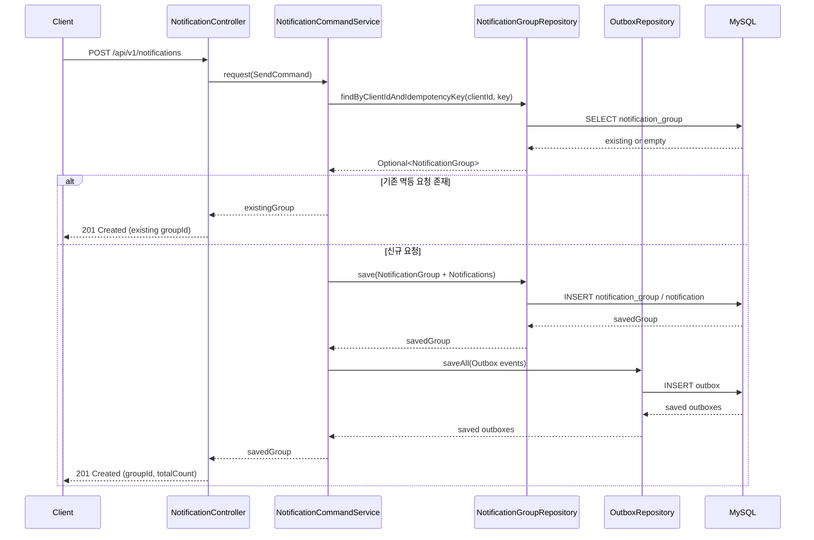
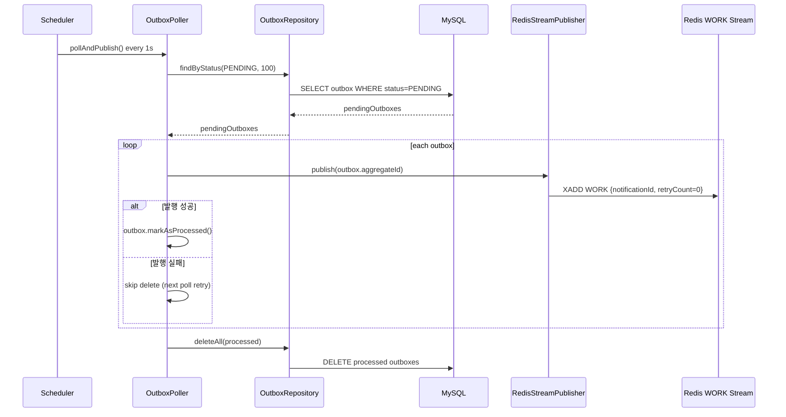
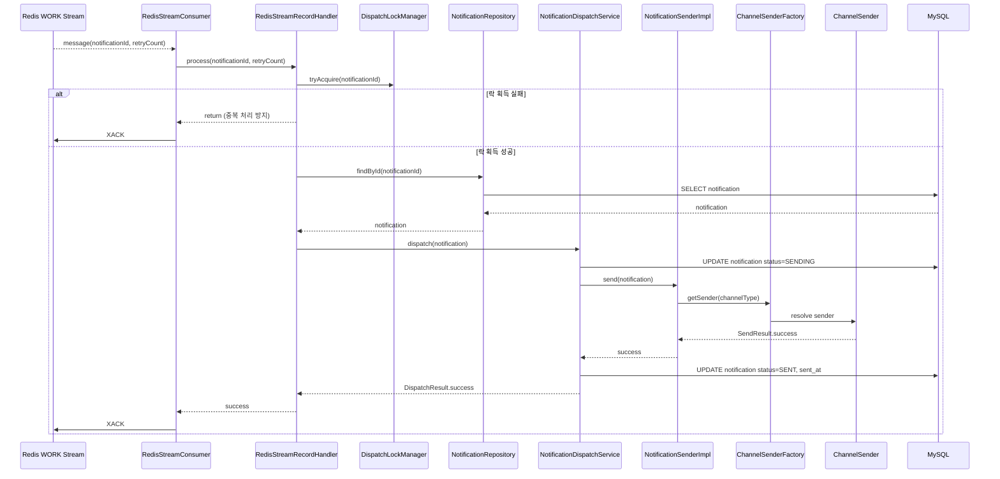
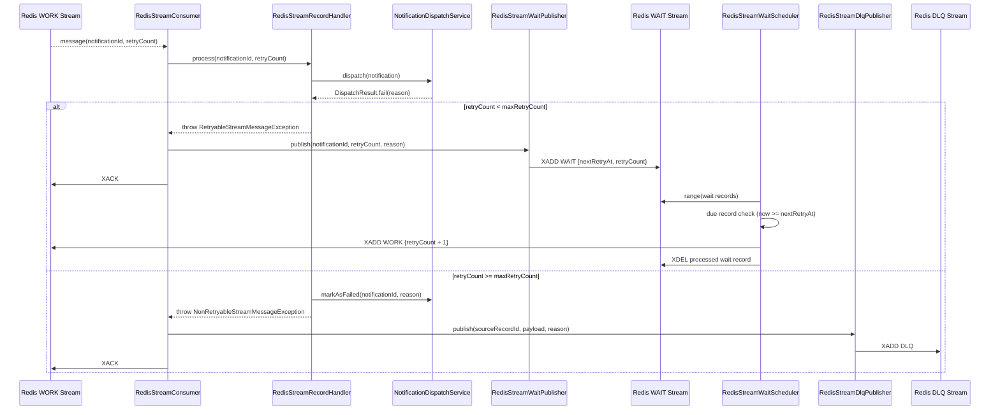
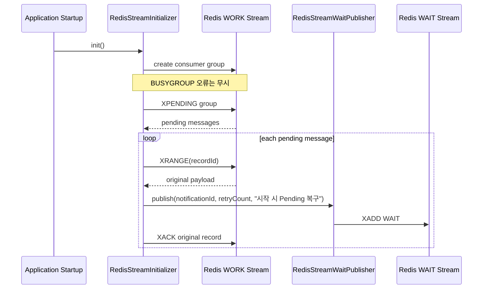

# 시퀀스 다이어그램

> Notification Dispatcher 주요 런타임 흐름

## 목차

- [알림 발송 요청 (동기)](#알림-발송-요청-동기)
- [Outbox 발행 (DB -> Redis)](#outbox-발행-db---redis)
- [WORK 소비 및 발송 성공](#work-소비-및-발송-성공)
- [발송 실패 재시도 (WAIT) 및 최종 실패 (DLQ)](#발송-실패-재시도-wait-및-최종-실패-dlq)
- [애플리케이션 시작 시 Pending 복구](#애플리케이션-시작-시-pending-복구)

---

## 알림 발송 요청 (동기)

핵심 포인트

- 멱등 키가 유효하면 그룹 재생성 없이 기존 그룹을 반환한다.
- 신규 요청은 그룹/알림 저장과 Outbox 저장이 동일 트랜잭션에서 처리된다.

---

## Outbox 발행 (DB -> Redis)

핵심 포인트

- 발행 성공 건만 삭제하여 최소 1회 이상(at-least-once) 전달을 보장한다.
- 발행 실패 건은 Outbox에 남겨 다음 주기에 재시도한다.

---

## WORK 소비 및 발송 성공

핵심 포인트

- `notificationId` 단위 분산 락으로 다중 컨슈머 중복 발송을 방지한다.
- 성공 시 `SENT` 상태로 저장 후 WORK 메시지를 ACK한다.

---

## 발송 실패 재시도 (WAIT) 및 최종 실패 (DLQ)

핵심 포인트

- 재시도 가능 오류는 WAIT 스트림으로 이동 후 지수 백오프로 재처리한다.
- 재시도 불가/한도 초과 오류는 DLQ로 이동해 운영자가 별도 대응한다.

---

## 애플리케이션 시작 시 Pending 복구

핵심 포인트

- 비정상 종료 등으로 남은 Pending 메시지를 기동 시점에 자동 회수한다.
- 복구 실패한 일부 메시지가 있어도 나머지 메시지 복구는 계속 진행한다.
