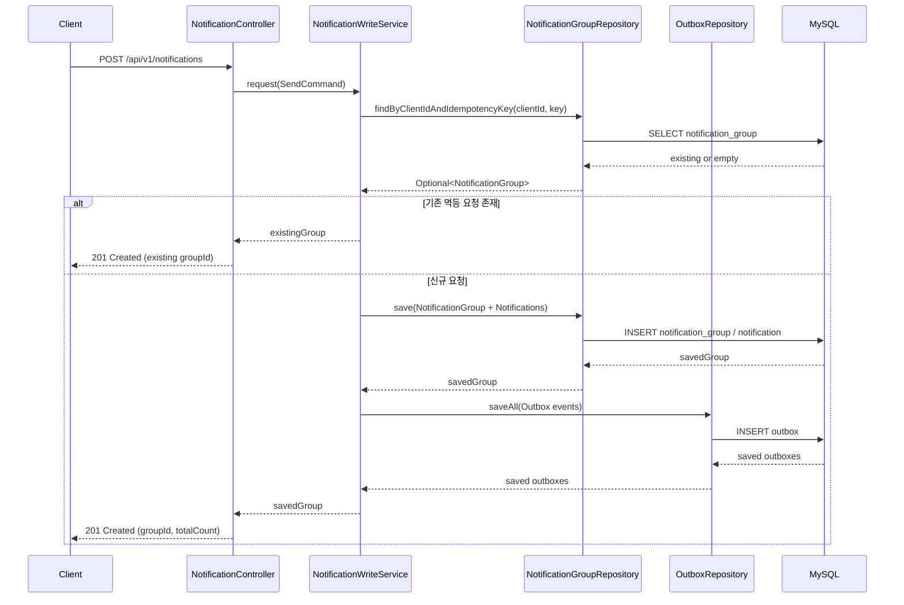
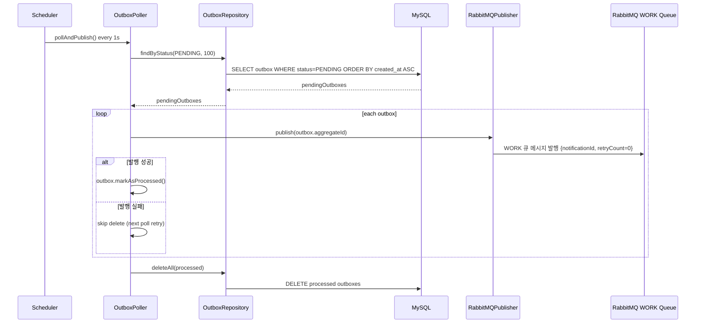
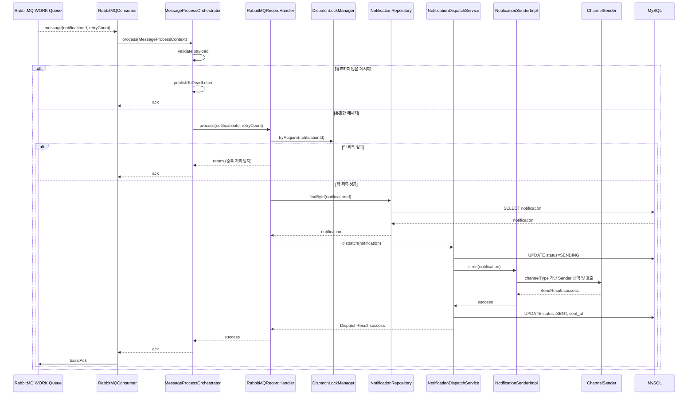
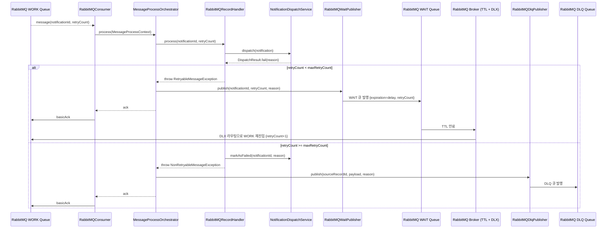
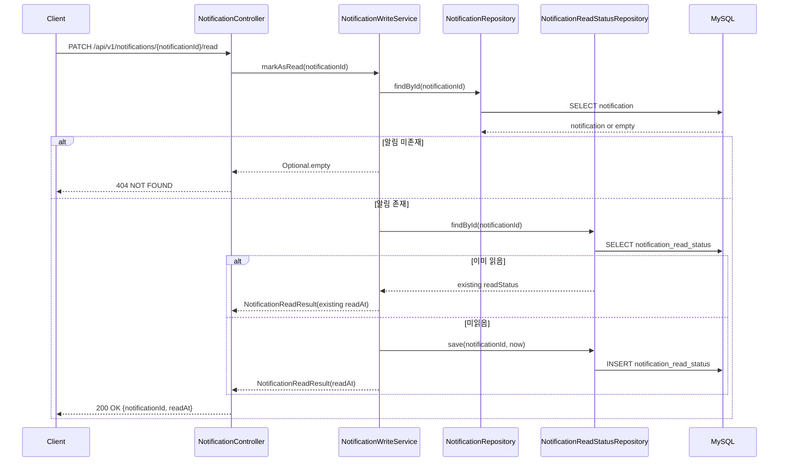
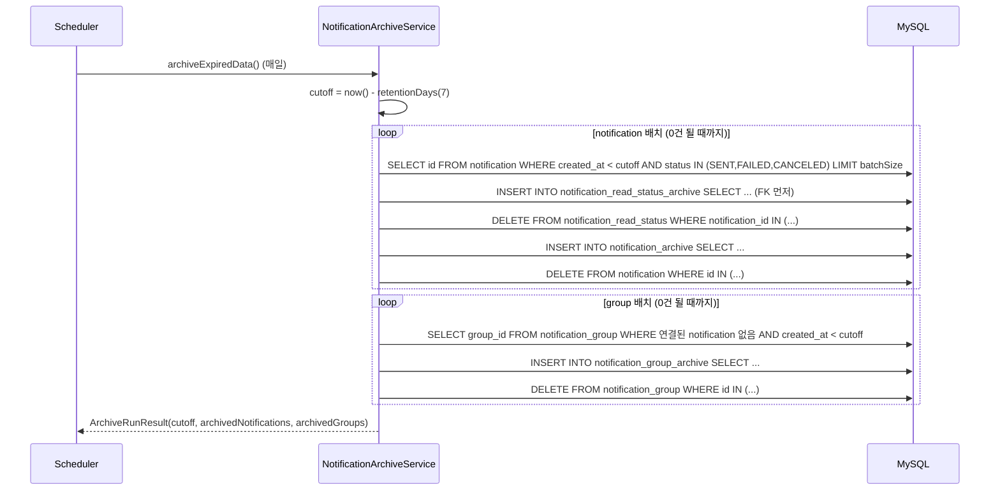
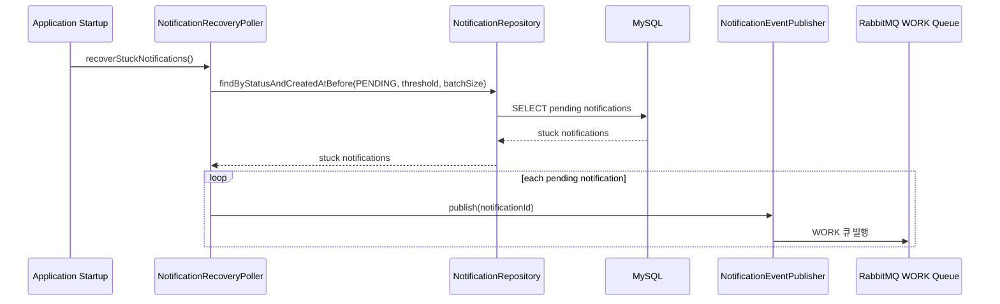

# 시퀀스 다이어그램

> Notification Dispatcher 주요 런타임 흐름

## 목차

- [알림 발송 요청 (동기)](#알림-발송-요청-동기)
- [Outbox 발행 (DB -> RabbitMQ)](#outbox-발행-db---rabbitmq)
- [WORK 소비 및 발송 성공](#work-소비-및-발송-성공)
- [발송 실패 재시도 (WAIT) 및 최종 실패 (DLQ)](#발송-실패-재시도-wait-및-최종-실패-dlq)
- [알림 읽음 처리](#알림-읽음-처리)
- [아카이브 배치](#아카이브-배치)
- [애플리케이션 시작 시 Pending 복구](#애플리케이션-시작-시-pending-복구)

---

## 알림 발송 요청 (동기)

핵심 포인트

- 멱등 키가 유효하면 그룹 재생성 없이 기존 그룹을 반환한다.
- 신규 요청은 그룹/알림 저장과 Outbox 저장이 동일 트랜잭션에서 처리된다.

---

## Outbox 발행 (DB -> RabbitMQ)

핵심 포인트

- 발행 성공 건만 삭제하여 최소 1회 이상(at-least-once) 전달을 보장한다.
- 발행 실패 건은 Outbox에 남겨 다음 주기에 재시도한다.

---

## WORK 소비 및 발송 성공

`batch-listener-enabled=false` (기본) 기준. 배치 모드(`RabbitMQBatchConsumer`)도 동일한 `MessageProcessOrchestrator`를 통해 처리한다.

핵심 포인트

- `MessageProcessOrchestrator`가 유효성 검사, 분기, DLQ 전송을 담당한다.
- `notificationId` 단위 분산 락으로 다중 컨슈머 중복 발송을 방지한다.
- 성공 시 `SENT` 상태로 저장 후 WORK 메시지를 ACK한다.

---

## 발송 실패 재시도 (WAIT) 및 최종 실패 (DLQ)

핵심 포인트

- 재시도 가능 오류는 WAIT 큐(TTL + DLX)로 이동 후 WORK 큐로 자동 재진입한다.
- 429 Rate Limit 응답 시 `Retry-After` 헤더 값을 WAIT TTL로 사용한다.
- 재시도 불가/한도 초과 오류는 DLQ로 이동해 운영자가 별도 대응한다.

---

## 알림 읽음 처리

핵심 포인트

- 읽음 상태는 `Notification` 엔티티가 아닌 별도 테이블 `notification_read_status`에서 관리한다.
- 이미 읽은 알림을 다시 읽음 처리해도 기존 `readAt`을 반환한다 (멱등).
- 그룹 읽음 처리(`PATCH /groups/{groupId}/read`)도 동일 패턴으로 그룹 내 알림을 일괄 처리한다.

---

## 아카이브 배치

핵심 포인트

- notification 먼저, group은 그 다음 (notification이 모두 없어진 그룹만 이관 가능).
- `notification_read_status` → `notification` 순서로 삭제 (FK 제약 준수).
- 각 단계는 `TransactionTemplate`으로 배치 단위 트랜잭션 처리.

---

## 애플리케이션 시작 시 Pending 복구

핵심 포인트

- 장시간 PENDING 상태 알림을 주기적으로 회수해 WORK 큐로 재발행한다.
- 일부 복구 실패가 발생해도 나머지 알림 복구는 계속 진행한다.
