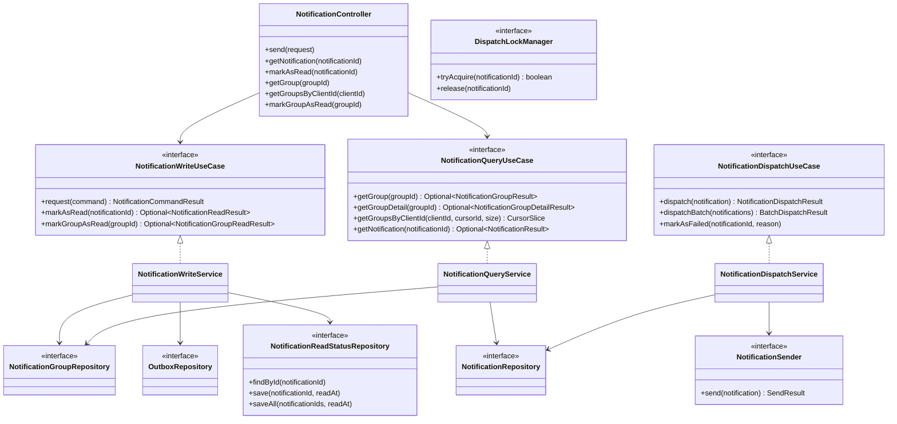
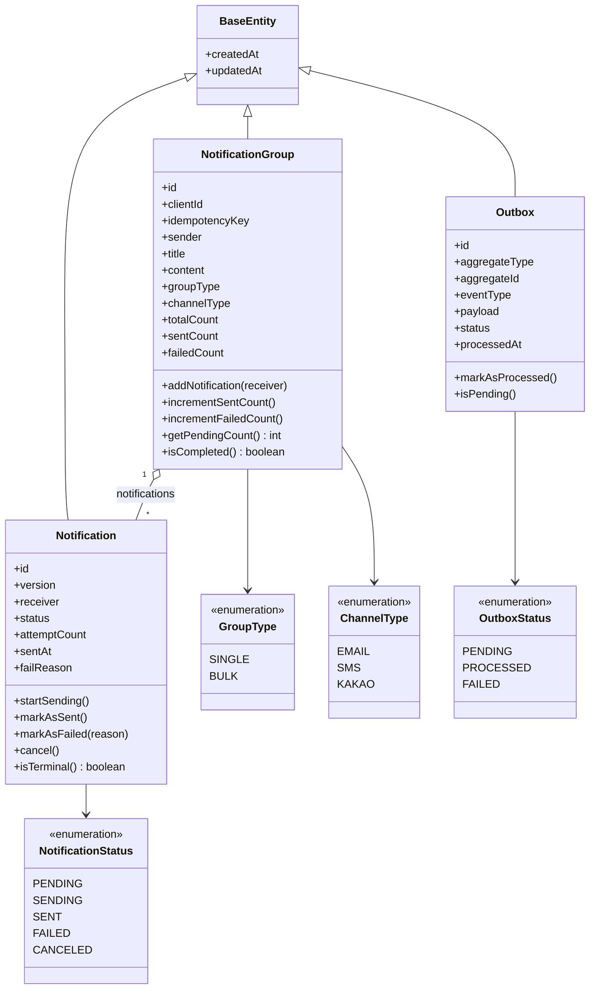
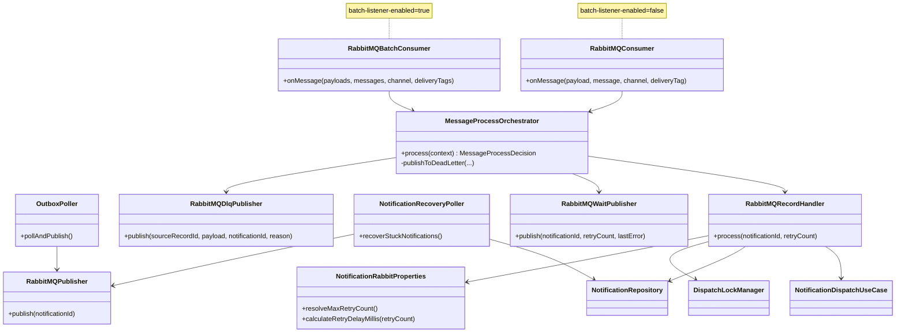
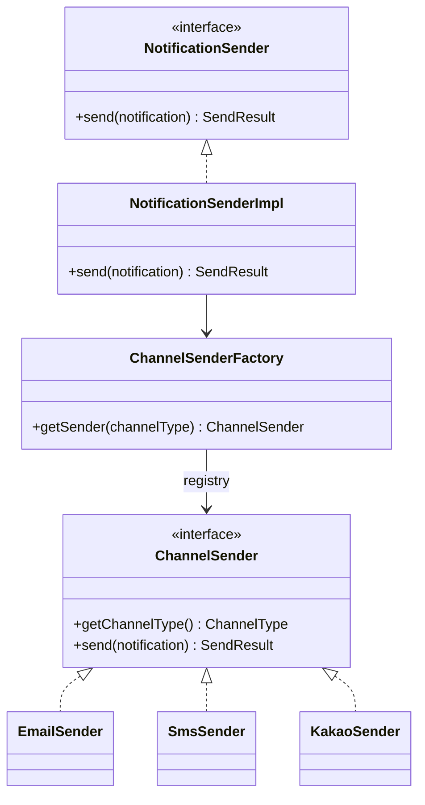
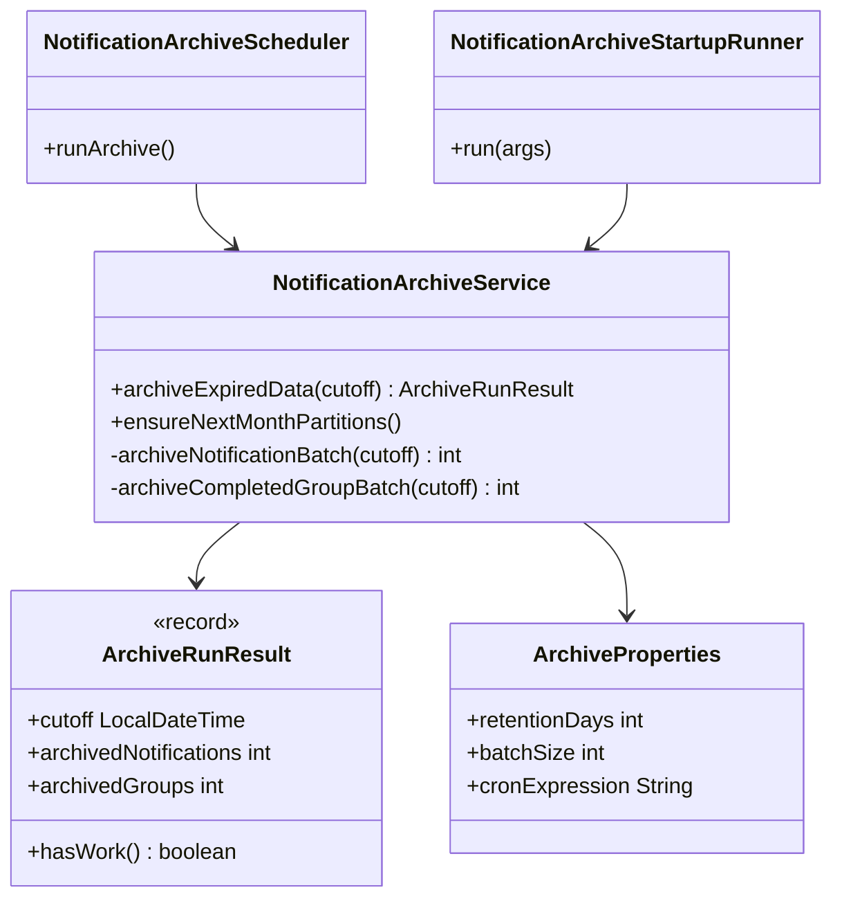

# 클래스 다이어그램

> Notification Dispatcher의 계층 구조와 핵심 클래스 관계

## 목차

- [레이어드 구조 (Hexagonal)](#레이어드-구조-hexagonal)
- [도메인 모델](#도메인-모델)
- [비동기 메시징 처리](#비동기-메시징-처리)
- [채널 발송 전략](#채널-발송-전략)
- [아카이브](#아카이브)
- [핵심 클래스 책임 요약](#핵심-클래스-책임-요약)

---

## 레이어드 구조 (Hexagonal)

---

## 도메인 모델

---

## 비동기 메시징 처리

---

## 채널 발송 전략

---

## 아카이브

---

## 핵심 클래스 책임 요약

| 클래스 | 레이어 | 주요 책임 |
|-------|--------|-----------|
| `NotificationController` | API | 요청 검증/DTO 변환/응답 생성 |
| `NotificationWriteService` | Application | 멱등성 검사, 그룹 생성, Outbox 저장, 읽음 처리 |
| `NotificationQueryService` | Application | 그룹/알림 조회, 커서 페이지 계산 |
| `NotificationDispatchService` | Application | 발송 상태 전이, 채널 발송 위임, 배치 발송 |
| `OutboxPoller` | Infrastructure | Outbox → WORK 큐 발행 |
| `RabbitMQConsumer` | Infrastructure | WORK 메시지 단건 소비 (기본 모드) |
| `RabbitMQBatchConsumer` | Infrastructure | WORK 메시지 배치 소비 (배치 모드) |
| `MessageProcessOrchestrator` | Infrastructure | 유효성 검사, 분기, DLQ 전송 공통 처리 |
| `RabbitMQRecordHandler` | Infrastructure | 분산 락/재시도 분기/실패 처리 |
| `NotificationRecoveryPoller` | Infrastructure | 장시간 PENDING 알림 재발행 |
| `NotificationSenderImpl` | Infrastructure | 채널별 Sender 전략 선택 |
| `DispatchLockManagerImpl` | Infrastructure | notificationId 단위 락 획득/해제 |
| `NotificationArchiveService` | Infrastructure | 만료 알림 archive 테이블 이관 및 파티션 관리 |
| `NotificationArchiveScheduler` | Infrastructure | 아카이브 배치 스케줄 실행 |
| `NotificationArchiveStartupRunner` | Infrastructure | 앱 시작 시 다음 달 파티션 사전 생성 |
