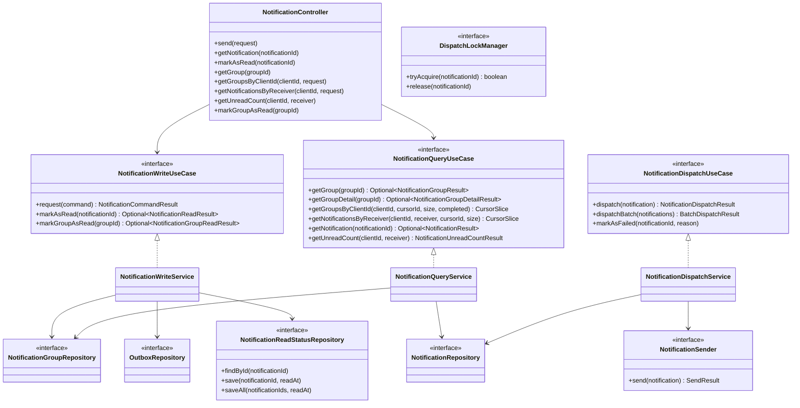
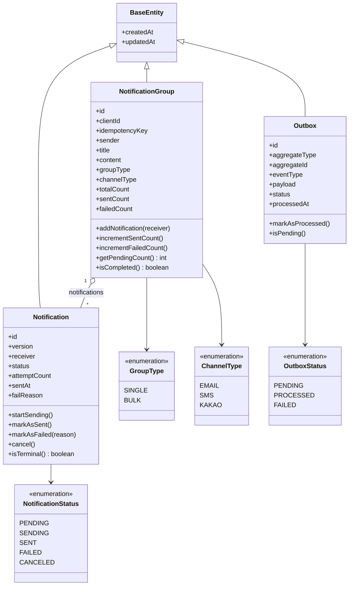
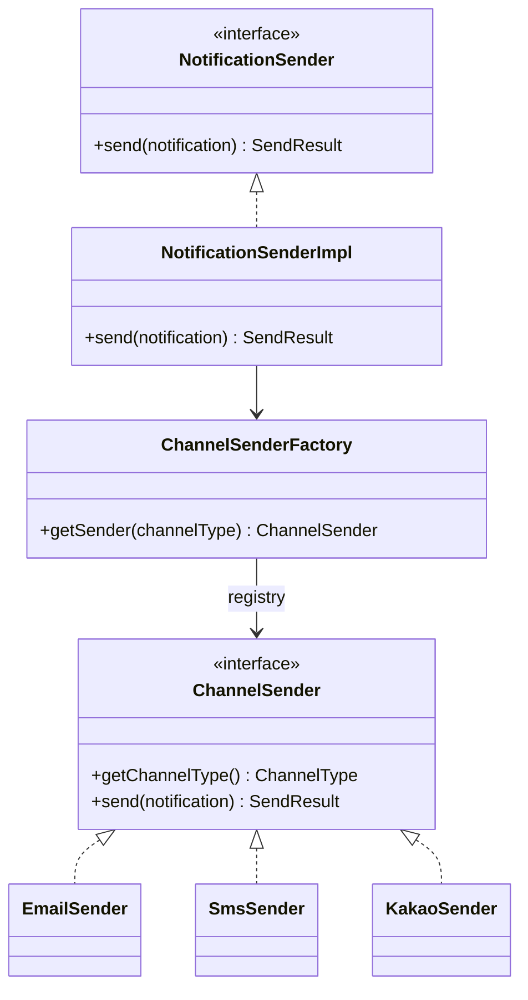
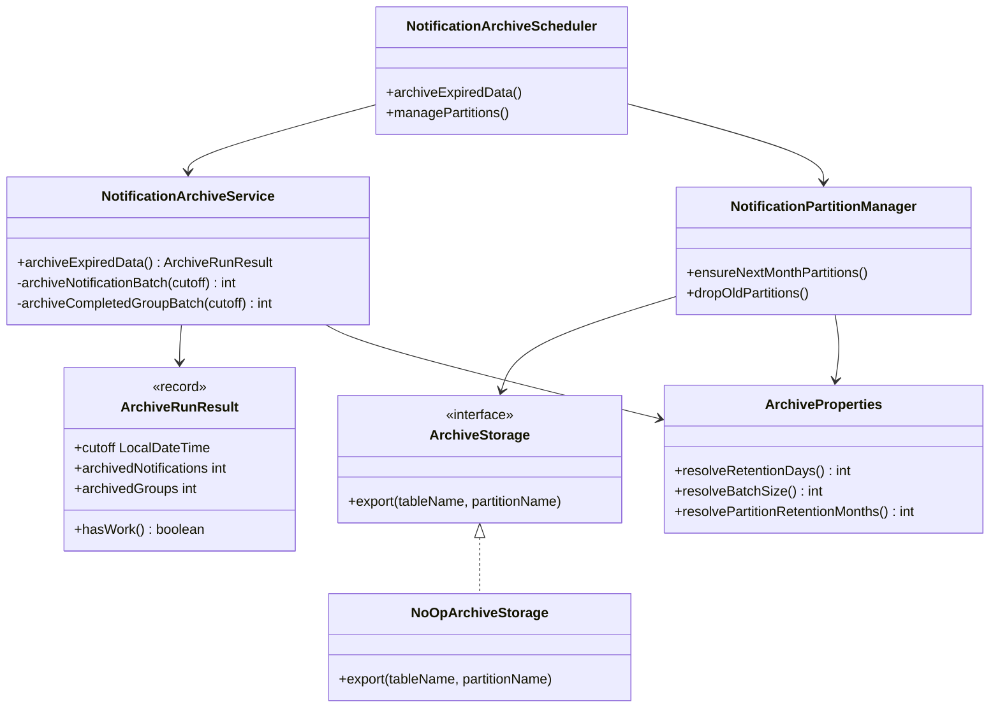
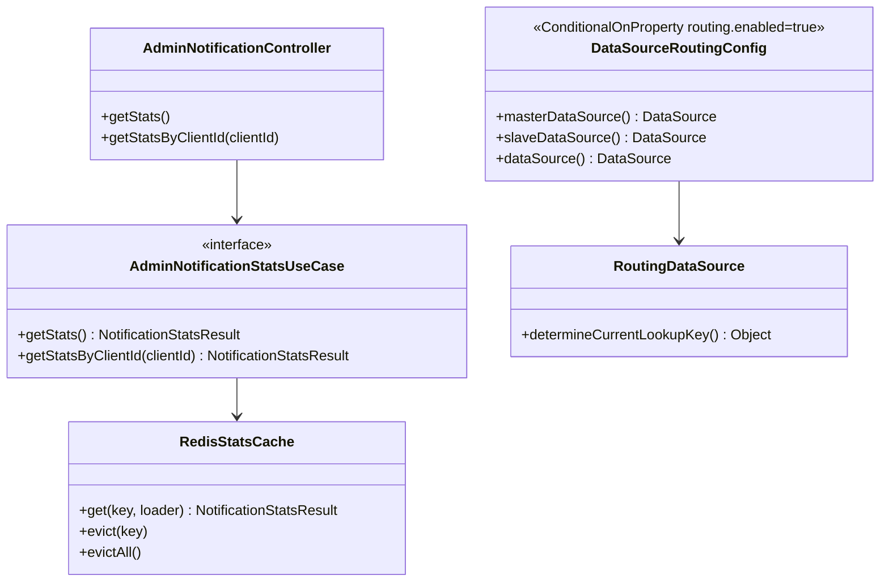

# 클래스 다이어그램

> Notification Dispatcher의 계층 구조와 핵심 클래스 관계

## 목차

- [레이어드 구조 (Hexagonal)](#레이어드-구조-hexagonal)
- [도메인 모델](#도메인-모델)
- [비동기 메시징 처리](#비동기-메시징-처리)
- [채널 발송 전략](#채널-발송-전략)
- [아카이브](#아카이브)
- [핵심 클래스 책임 요약](#핵심-클래스-책임-요약)

---

## 레이어드 구조 (Hexagonal)

---

## 도메인 모델

---

## 비동기 메시징 처리

```mermaid
classDiagram
    class OutboxPoller {
      +pollAndPublish()
    }

    class RabbitMQPublisher {
      +publish(notificationId)
    }

    class RabbitMQSingleConsumer {
      +onMessage(message, channel)
    }

    class DeadLetterPublisher {
      <<interface>>
      +publish(sourceRecordId, payload, notificationId, reason)
    }

    class WaitPublisher {
      <<interface>>
      +publish(notificationId, retryCount, lastError)
      +publish(notificationId, retryCount, lastError, retryDelayMillis)
    }

    class RabbitMQDlqPublisher {
      +publish(sourceRecordId, payload, notificationId, reason)
    }

    class RabbitMQWaitPublisher {
      +publish(notificationId, retryCount, lastError, retryDelayMillis)
    }

    class RabbitMQRecordHandler {
      +processBatch(requests) List~RecordProcessResult~
    }

    class NotificationRecoveryPoller {
      +recoverStuckNotifications()
    }

    class NotificationRabbitProperties {
      +resolveMaxRetryCount()
      +calculateRetryDelayMillis(retryCount, overrideMillis)
    }

    OutboxPoller --> RabbitMQPublisher

    RabbitMQSingleConsumer --> RabbitMQRecordHandler
    RabbitMQSingleConsumer --> DeadLetterPublisher
    RabbitMQSingleConsumer --> WaitPublisher

    DeadLetterPublisher <|.. RabbitMQDlqPublisher
    WaitPublisher <|.. RabbitMQWaitPublisher

    RabbitMQRecordHandler --> NotificationDispatchUseCase
    RabbitMQRecordHandler --> NotificationRepository
    RabbitMQRecordHandler --> DispatchLockManager
    RabbitMQRecordHandler --> NotificationRabbitProperties

    NotificationRecoveryPoller --> NotificationRepository
    NotificationRecoveryPoller --> RabbitMQPublisher
```

---

## 채널 발송 전략

---

## 아카이브

---

## 캐시 및 데이터소스

---

## 핵심 클래스 책임 요약

| 클래스 | 레이어 | 주요 책임 |
|-------|--------|-----------|
| `NotificationController` | API | 요청 검증/DTO 변환/응답 생성 |
| `AdminNotificationController` | API | 관리자 통계 API (전체/클라이언트별) |
| `NotificationWriteService` | Application | 멱등성 검사, 그룹 생성, Outbox 저장, 읽음 처리 |
| `NotificationQueryService` | Application | 그룹/알림/수신자별 조회, 커서 페이지 계산 |
| `NotificationDispatchService` | Application | 발송 상태 전이, 채널 발송 위임, 배치 발송 |
| `OutboxPoller` | Infrastructure | Outbox → WORK 큐 발행 |
| `RabbitMQSingleConsumer` | Infrastructure | WORK 메시지 단건 소비, 유효성 검사, DLQ/WAIT 분기 |
| `RabbitMQRecordHandler` | Infrastructure | 분산 락 획득, 발송 위임, 재시도/실패 결과 반환 |
| `NotificationRecoveryPoller` | Infrastructure | 장시간 PENDING 알림 재발행 |
| `NotificationSenderImpl` | Infrastructure | 채널별 Sender 전략 선택 |
| `DispatchLockManagerImpl` | Infrastructure | notificationId 단위 락 획득/해제 |
| `RedisStatsCache` | Infrastructure | 관리자 통계 Redis 캐시 (cache.stats.enabled) |
| `NotificationArchiveService` | Infrastructure | 만료 알림 archive 테이블 이관 |
| `NotificationPartitionManager` | Infrastructure | 월별 파티션 생성 및 오래된 파티션 삭제 |
| `NotificationArchiveScheduler` | Infrastructure | 아카이브 배치 및 파티션 관리 스케줄 실행 |
