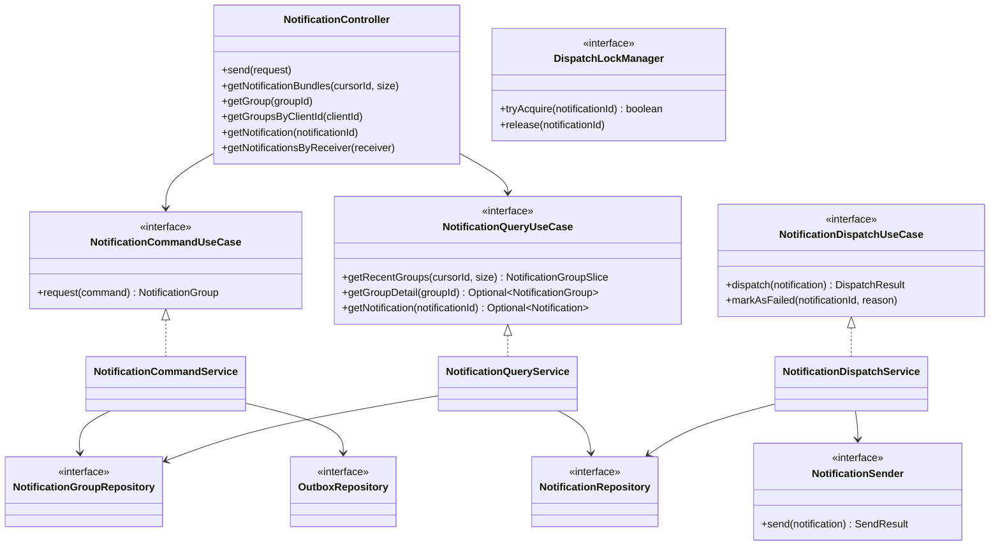
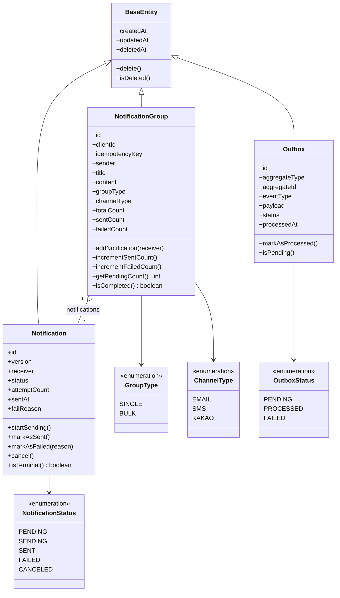
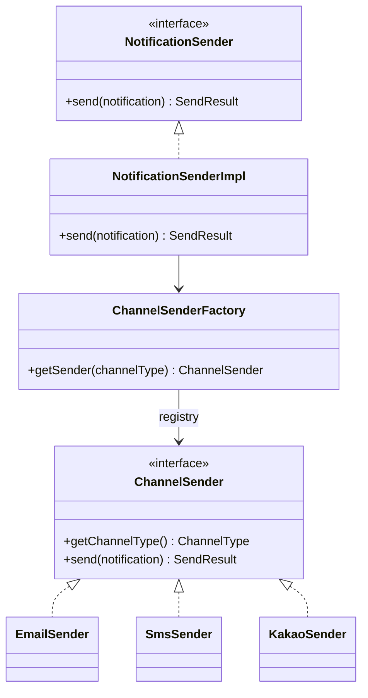

# 클래스 다이어그램

> Notification Dispatcher의 계층 구조와 핵심 클래스 관계

## 목차

- [레이어드 구조 (Hexagonal)](#레이어드-구조-hexagonal)
- [도메인 모델](#도메인-모델)
- [비동기 스트림 처리](#비동기-스트림-처리)
- [채널 발송 전략](#채널-발송-전략)
- [핵심 클래스 책임 요약](#핵심-클래스-책임-요약)

---

## 레이어드 구조 (Hexagonal)

---

## 도메인 모델

---

## 비동기 스트림 처리

```mermaid
classDiagram
    class OutboxPoller {
      +pollAndPublish()
    }

    class RedisStreamPublisher {
      +publish(notificationId)
    }

    class RedisStreamConsumer {
      +onMessage(record)
    }

    class RedisStreamRecordHandler {
      +process(notificationId, retryCount)
    }

    class RedisStreamWaitScheduler {
      +processWaitingMessages()
    }

    class RedisStreamWaitPublisher {
      +publish(notificationId, retryCount, lastError)
    }

    class RedisStreamDlqPublisher {
      +publish(sourceRecordId, payload, notificationId, reason)
    }

    class RedisStreamInitializer {
      +init()
    }

    class NotificationStreamProperties {
      +resolveKey(type)
      +resolveMaxRetryCount()
      +calculateRetryDelayMillis(retryCount)
    }

    class NotificationStreamPayload {
      +notificationId
      +retryCount
    }

    class NotificationWaitPayload {
      +notificationId
      +retryCount
      +nextRetryAt
      +lastError
    }

    class NotificationDeadLetterPayload {
      +recordId
      +notificationId
      +payload
      +reason
      +failedAt
    }

    OutboxPoller --> RedisStreamPublisher
    OutboxPoller --> NotificationStreamProperties

    RedisStreamConsumer --> RedisStreamRecordHandler
    RedisStreamConsumer --> RedisStreamWaitPublisher
    RedisStreamConsumer --> RedisStreamDlqPublisher
    RedisStreamConsumer --> NotificationStreamProperties

    RedisStreamRecordHandler --> NotificationDispatchUseCase
    RedisStreamRecordHandler --> NotificationRepository
    RedisStreamRecordHandler --> DispatchLockManager
    RedisStreamRecordHandler --> NotificationStreamProperties

    RedisStreamWaitScheduler --> NotificationStreamProperties
    RedisStreamWaitScheduler --> NotificationStreamPayload
    RedisStreamWaitScheduler --> NotificationWaitPayload
    RedisStreamWaitPublisher --> NotificationWaitPayload
    RedisStreamDlqPublisher --> NotificationDeadLetterPayload

    RedisStreamInitializer --> RedisStreamWaitPublisher
    RedisStreamInitializer --> NotificationStreamPayload
    RedisStreamInitializer --> NotificationStreamProperties
```

---

## 채널 발송 전략

---

## 핵심 클래스 책임 요약

| 클래스 | 레이어 | 주요 책임 |
|-------|--------|-----------|
| `NotificationController` | API | 요청 검증/DTO 변환/응답 생성 |
| `NotificationCommandService` | Application | 멱등성 검사, 그룹 생성, Outbox 저장 |
| `NotificationQueryService` | Application | 그룹/알림 조회, 커서 페이지 계산 |
| `NotificationDispatchService` | Application | 발송 상태 전이, 채널 발송 위임 |
| `OutboxPoller` | Infrastructure | Outbox -> WORK 스트림 발행 |
| `RedisStreamConsumer` | Infrastructure | WORK 메시지 소비 및 ACK 제어 |
| `RedisStreamRecordHandler` | Infrastructure | 분산 락/재시도 분기/실패 처리 |
| `RedisStreamWaitScheduler` | Infrastructure | WAIT 만료 메시지 재발행 |
| `NotificationSenderImpl` | Infrastructure | 채널별 Sender 전략 선택 |
| `DispatchLockManagerImpl` | Infrastructure | notificationId 단위 락 획득/해제 |
