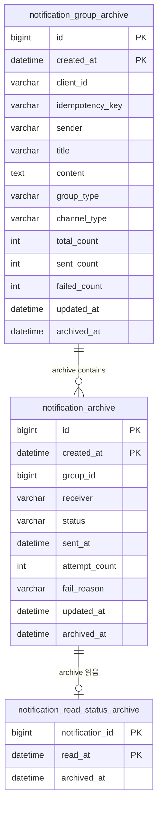

# ERD (Entity Relationship Diagram)

> 기준
> - `infrastructure/src/main/resources/db/migration/V1__init_schema.sql`
> - `domain/src/main/java/com/example/domain/`

## 목차

- [메인 테이블 ERD](#메인-테이블-erd)
- [아카이브 테이블 ERD](#아카이브-테이블-erd)
- [핵심 관계 설명](#핵심-관계-설명)
- [테이블 상세](#테이블-상세)
  - [notification_group](#notification_group)
  - [notification](#notification)
  - [notification_read_status](#notification_read_status)
  - [outbox](#outbox)
  - [아카이브 테이블](#아카이브-테이블)
- [운영 관점 체크포인트](#운영-관점-체크포인트)

---

## 메인 테이블 ERD

```mermaid
erDiagram
    notification_group ||--o{ notification : contains
    notification ||--o| notification_read_status : "읽음 상태"

    notification_group {
      bigint id PK
      varchar client_id
      varchar idempotency_key
      varchar sender
      varchar title
      text content
      varchar group_type
      varchar channel_type
      int total_count
      int sent_count
      int failed_count
      datetime created_at
      datetime updated_at
    }

    notification {
      bigint id PK
      bigint group_id FK
      varchar receiver
      varchar status
      datetime sent_at
      int attempt_count
      varchar fail_reason
      bigint version
      datetime created_at
      datetime updated_at
    }

    notification_read_status {
      bigint notification_id PK_FK
      datetime read_at
    }

    outbox {
      bigint id PK
      varchar aggregate_type
      bigint aggregate_id
      varchar event_type
      text payload
      varchar status
      datetime processed_at
      datetime created_at
      datetime updated_at
    }
```

---

## 아카이브 테이블 ERD



> 아카이브 테이블은 모두 월별 RANGE 파티션 (`YEAR * 100 + MONTH`) 구조이다.

---

## 핵심 관계 설명

- `notification_group` 1건은 `notification` N건을 가진다. (`group_id` FK)
- `notification_read_status`는 `notification`에 대한 읽음 상태를 별도 테이블로 관리한다. (1:0..1 관계)
- `outbox.aggregate_id`는 물리 FK가 아닌 논리 참조로 `notification.id`를 가리킨다.
- `notification_group(client_id, idempotency_key)` 유니크 인덱스로 멱등 요청을 제어한다.
- 메인 테이블은 7일 보관 후 archive 테이블로 이관 및 physical delete 처리한다.
- archive 테이블은 사용자 조회 API 없음. 운영/감사 목적으로만 존재한다.

---

## 테이블 상세

### notification_group

| 컬럼명 | 타입 | 제약조건 | 설명 |
|---|---|---|---|
| id | BIGINT | PK, AUTO_INCREMENT | 그룹 식별자 |
| client_id | VARCHAR(255) | NOT NULL | 발송 요청 클라이언트 |
| idempotency_key | VARCHAR(255) | NULL | 멱등성 키 |
| sender | VARCHAR(255) | NOT NULL | 발신자 |
| title | VARCHAR(255) | NOT NULL | 제목 |
| content | TEXT | NOT NULL | 본문 |
| group_type | VARCHAR(50) | NOT NULL | `SINGLE` / `BULK` |
| channel_type | VARCHAR(50) | NOT NULL | `EMAIL` / `SMS` / `KAKAO` |
| total_count | INT | NOT NULL DEFAULT 0 | 전체 알림 수 |
| sent_count | INT | NOT NULL DEFAULT 0 | 성공 수 |
| failed_count | INT | NOT NULL DEFAULT 0 | 실패 수 |
| created_at | DATETIME(6) | NOT NULL | 생성 시각 |
| updated_at | DATETIME(6) | NOT NULL | 수정 시각 |

인덱스

- `idx_notification_group_client_idempotency_key` (UNIQUE): `(client_id, idempotency_key)`
- `idx_notification_group_client_id`: `(client_id)`
- `idx_notification_group_group_type`: `(group_type)`
- `idx_notification_group_client_created`: `(client_id, created_at)` ← 핵심 조회 인덱스

### notification

| 컬럼명 | 타입 | 제약조건 | 설명 |
|---|---|---|---|
| id | BIGINT | PK, AUTO_INCREMENT | 알림 식별자 |
| group_id | BIGINT | FK(NULL 허용) | 소속 그룹 |
| receiver | VARCHAR(255) | NOT NULL | 수신자 |
| status | VARCHAR(50) | NOT NULL | `PENDING/SENDING/SENT/FAILED/CANCELED` |
| sent_at | DATETIME(6) | NULL | 발송 완료 시각 |
| attempt_count | INT | NOT NULL DEFAULT 0 | 발송 시도 횟수 |
| fail_reason | VARCHAR(500) | NULL | 실패 사유 |
| version | BIGINT | NOT NULL DEFAULT 0 | 낙관적 락 버전 |
| created_at | DATETIME(6) | NOT NULL | 생성 시각 |
| updated_at | DATETIME(6) | NOT NULL | 수정 시각 |

인덱스

- `idx_notification_group_id`: `(group_id)`
- `idx_notification_receiver`: `(receiver)`
- `idx_notification_receiver_status`: `(receiver, status)`
- `idx_notification_status_created`: `(status, created_at)` ← 아카이브 배치 조회
- `idx_notification_group_status`: `(group_id, status)`

### notification_read_status

| 컬럼명 | 타입 | 제약조건 | 설명 |
|---|---|---|---|
| notification_id | BIGINT | PK, FK → notification(id) | 알림 식별자 |
| read_at | DATETIME(6) | NOT NULL | 읽음 처리 시각 |

인덱스

- `idx_notification_read_status_read_at`: `(read_at)` ← 아카이브 배치 조회

> `Notification` 엔티티와 별도 테이블로 분리한 이유: 읽음 상태를 Notification에 추가하면 캐시 무효화가 복잡해진다. 별도 테이블로 관리하면 terminal 상태 알림의 캐싱이 가능하다.

### outbox

| 컬럼명 | 타입 | 제약조건 | 설명 |
|---|---|---|---|
| id | BIGINT | PK, AUTO_INCREMENT | Outbox 식별자 |
| aggregate_type | VARCHAR(255) | NOT NULL | Aggregate 타입 (`Notification`) |
| aggregate_id | BIGINT | NOT NULL | Aggregate ID (notificationId) |
| event_type | VARCHAR(255) | NOT NULL | 이벤트 타입 (`NotificationCreated`) |
| payload | TEXT | NULL | 확장용 payload |
| status | VARCHAR(50) | NOT NULL | `PENDING/PROCESSED/FAILED` |
| processed_at | DATETIME(6) | NULL | 처리 시각 |
| created_at | DATETIME(6) | NOT NULL | 생성 시각 |
| updated_at | DATETIME(6) | NOT NULL | 수정 시각 |

인덱스

- `idx_outbox_status_created`: `(status, created_at)` ← Poller 조회 핵심 인덱스

### 아카이브 테이블

모든 아카이브 테이블은 메인 테이블에 `archived_at` 컬럼을 추가한 구조이며, `PARTITION BY RANGE (YEAR(created_at) * 100 + MONTH(created_at))`로 월별 파티셔닝되어 있다.

| 테이블 | 파티션 키 | 추가 컬럼 | 비고 |
|--------|----------|-----------|------|
| `notification_archive` | `created_at` | `archived_at` | PK: `(id, created_at)` |
| `notification_group_archive` | `created_at` | `archived_at` | PK: `(id, created_at)` |
| `notification_read_status_archive` | `read_at` | `archived_at` | PK: `(notification_id, read_at)` |

파티션 구조:

- DDL에 2026-01 ~ 2027-12 (24개) 사전 정의
- 이후 데이터는 `p_future` 파티션으로 수용
- `NotificationArchiveStartupRunner`가 앱 시작 시 다음 달 파티션 자동 생성

---

## 운영 관점 체크포인트

- 중복 요청 제어: `notification_group(client_id, idempotency_key)` 유니크 인덱스
- 중복 처리 제어: Redis 분산 락 `dispatch-lock:{notificationId}`
- 낙관적 락: `notification.version` 컬럼으로 동시 수정 충돌 감지
- 커서 조회 최적화: 그룹 조회는 `id DESC` 및 `cursorId` 조건으로 동작
- 읽음 상태 분리: `notification_read_status` 별도 테이블 (캐시 설계 고려)
- 메인 데이터 삭제: archive 배치의 physical delete로 정리 (soft delete 없음)
- 파티션 관리: 매달 앱 시작 시 자동 생성, 오래된 파티션은 DROP PARTITION으로 삭제
