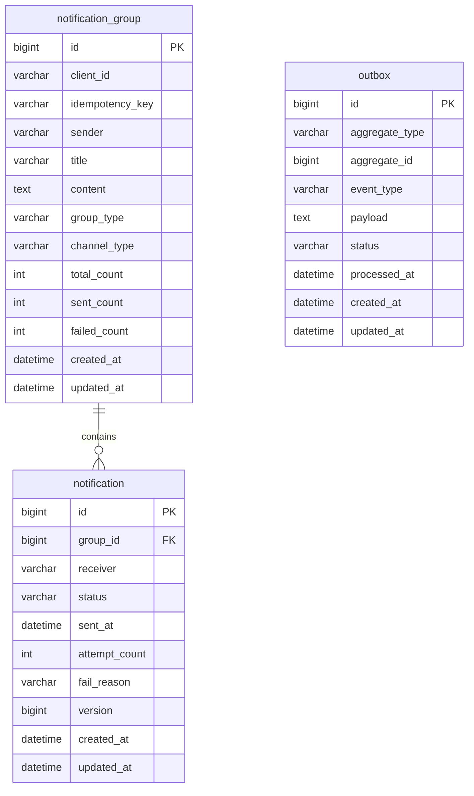

# ERD (Entity Relationship Diagram)

> 기준
> - `infrastructure/src/main/resources/db/migration/V1__init_schema.sql`
> - `domain/src/main/java/com/example/domain/outbox/Outbox.java`

## 목차

- [전체 ERD](#전체-erd)
- [핵심 관계 설명](#핵심-관계-설명)
- [테이블 상세](#테이블-상세)
  - [notification_group](#notification_group)
  - [notification](#notification)
  - [outbox](#outbox)
- [운영 관점 체크포인트](#운영-관점-체크포인트)

---

## 전체 ERD

---

## 핵심 관계 설명

- `notification_group` 1건은 `notification` N건을 가진다. (`group_id` FK)
- `outbox.aggregate_id`는 물리 FK가 아니라 논리 참조로 `notification.id`를 가리킨다.
- `notification_group(client_id, idempotency_key)` 유니크 인덱스로 멱등 요청을 제어한다.
- 메인 도메인 테이블은 physical delete 모델을 사용하고, 장기 보관은 archive 테이블이 담당한다.

---

## 테이블 상세

### notification_group

| 컬럼명 | 타입 | 제약조건 | 설명 |
|---|---|---|---|
| id | BIGINT | PK, AUTO_INCREMENT | 그룹 식별자 |
| client_id | VARCHAR(255) | NOT NULL | 발송 요청 클라이언트 |
| idempotency_key | VARCHAR(255) | NULL | 멱등성 키 |
| sender | VARCHAR(255) | NOT NULL | 발신자 |
| title | VARCHAR(255) | NOT NULL | 제목 |
| content | TEXT | NOT NULL | 본문 |
| group_type | VARCHAR(50) | NOT NULL | `SINGLE` / `BULK` |
| channel_type | VARCHAR(50) | NOT NULL | `EMAIL` / `SMS` / `KAKAO` |
| total_count | INT | NOT NULL DEFAULT 0 | 전체 알림 수 |
| sent_count | INT | NOT NULL DEFAULT 0 | 성공 수 |
| failed_count | INT | NOT NULL DEFAULT 0 | 실패 수 |
| created_at | DATETIME(6) | NOT NULL | 생성 시각 |
| updated_at | DATETIME(6) | NOT NULL | 수정 시각 |

인덱스

- `idx_notification_group_client_idempotency_key` (UNIQUE): `(client_id, idempotency_key)`
- `idx_notification_group_client_id`: `(client_id)`
- `idx_notification_group_group_type`: `(group_type)`
- `idx_notification_group_client_created`: `(client_id, created_at)`

### notification

| 컬럼명 | 타입 | 제약조건 | 설명 |
|---|---|---|---|
| id | BIGINT | PK, AUTO_INCREMENT | 알림 식별자 |
| group_id | BIGINT | FK(NULL 허용) | 소속 그룹 |
| receiver | VARCHAR(255) | NOT NULL | 수신자 |
| status | VARCHAR(50) | NOT NULL | `PENDING/SENDING/SENT/FAILED/CANCELED` |
| sent_at | DATETIME(6) | NULL | 발송 완료 시각 |
| attempt_count | INT | NOT NULL DEFAULT 0 | 발송 시도 횟수 |
| fail_reason | VARCHAR(500) | NULL | 실패 사유 |
| version | BIGINT | NOT NULL DEFAULT 0 | 낙관적 락 버전 |
| created_at | DATETIME(6) | NOT NULL | 생성 시각 |
| updated_at | DATETIME(6) | NOT NULL | 수정 시각 |

인덱스

- `idx_notification_group_id`: `(group_id)`
- `idx_notification_receiver`: `(receiver)`
- `idx_notification_receiver_status`: `(receiver, status)`
- `idx_notification_status_created`: `(status, created_at)`
- `idx_notification_group_status`: `(group_id, status)`

### outbox

| 컬럼명 | 타입 | 제약조건 | 설명 |
|---|---|---|---|
| id | BIGINT | PK, AUTO_INCREMENT | Outbox 식별자 |
| aggregate_type | VARCHAR(255) | NOT NULL | Aggregate 타입 (`Notification`) |
| aggregate_id | BIGINT | NOT NULL | Aggregate ID (notificationId) |
| event_type | VARCHAR(255) | NOT NULL | 이벤트 타입 (`NotificationCreated`) |
| payload | TEXT | NULL | 확장용 payload |
| status | VARCHAR(50) | NOT NULL | `PENDING/PROCESSED/FAILED` |
| processed_at | DATETIME(6) | NULL | 처리 시각 |
| created_at | DATETIME(6) | NOT NULL | 생성 시각 |
| updated_at | DATETIME(6) | NOT NULL | 수정 시각 |

인덱스

- `idx_outbox_status_created`: `(status, created_at)`

> 참고: `outbox`는 도메인 엔티티에 정의되어 있으며, 운영 환경에서는 Flyway 스키마와 동일하게 관리되어야 한다.

---

## 운영 관점 체크포인트

- 중복 요청 제어: `notification_group(client_id, idempotency_key)`
- 중복 처리 제어: Redis 분산 락 `dispatch-lock:{notificationId}`
- 낙관적 락: `notification.version` 컬럼으로 동시 수정 충돌 감지
- 커서 조회 최적화: 그룹 조회는 `id DESC` 및 `cursorId` 조건으로 동작
- 메인 데이터 삭제는 archive 배치의 physical delete로 정리됨
